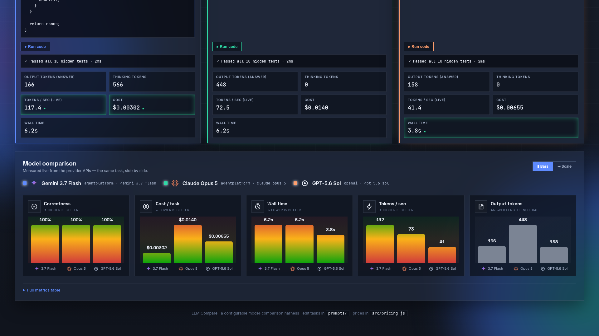
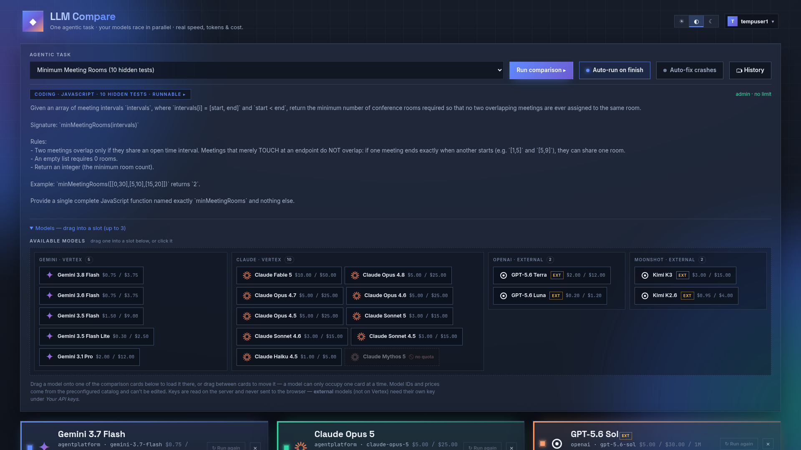
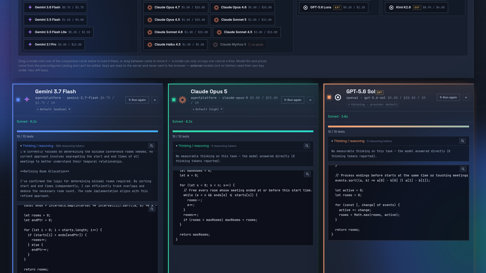
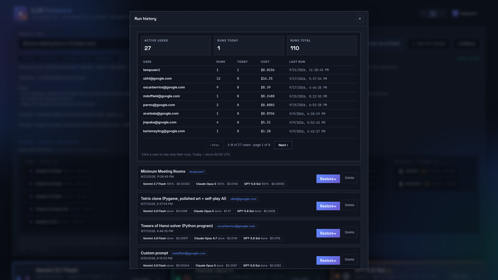
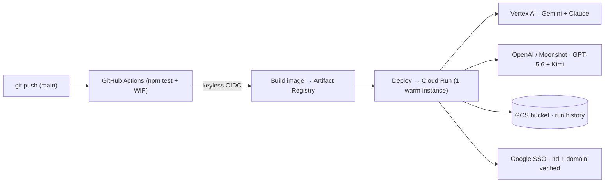
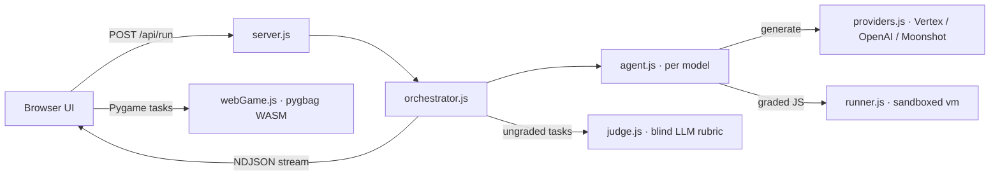

<p align="center">
  
</p>

<h1 align="center">LLM Compare</h1>

<p align="center">
  <b>Race the same agentic coding, business, or game-building task across multiple LLMs and compare them on what a buyer actually cares about — correctness, speed, tokens, and cost — measured live.</b>
</p>

<p align="center">
  <a href="https://youtu.be/mrylqpgjiVI"></a>
  <a href="https://ssh.cloud.google.com/cloudshell/editor?cloudshell_git_repo=https%3A%2F%2Fgithub.com%2FUbhiTS%2Fllm-compare.git&cloudshell_tutorial=click-to-deploy%2FREADME.md"></a>
  = 18">
  
  
  
</p>

---

**LLM Compare** sends the **same task** to up to three LLMs concurrently. For graded coding tasks, each model writes a solution and the harness runs it against **hidden edge-case tests** in an isolated sandbox; for open-ended Business, General, and Pygame tasks, a **blind LLM judge** (`src/judge.js`) scores the full unredacted outputs on a weighted rubric. Every model is measured live on **correctness, cost, wall-time, and token throughput**, streamed token-by-token to the browser. It's a dependency-light Node/Express + vanilla-JS app that runs locally in one command and deploys to **Google Cloud Run** with keyless CI.

## 🎥 Video Walkthrough & Live Screenshots

<p align="center">
  <a href="https://youtu.be/mrylqpgjiVI" target="_blank" rel="noopener noreferrer">
    
  </a>
  <br>
  <b>▶️ <a href="https://youtu.be/mrylqpgjiVI">Watch the 1080p Live Demo Walkthrough on YouTube (https://youtu.be/mrylqpgjiVI)</a></b>
</p>

| 1. 3-Model Arena Setup (`Gemini 3.7 Flash` vs `Claude Opus 5` vs `GPT-5.6 Sol`) | 2. Live Streaming Race & Hidden Test Execution |
| :---: | :---: |
|  |  |
| **3. Neutral Per-Metric Scorecard (Correctness, Cost, Speed, Throughput)** | **4. Per-User Durable Run History & Replay** |
|  |  |

### Why it's a credible demo, not a rigged one

Every number is **measured live** from the provider APIs — real latency, the token counts the APIs return, and **your** server-locked prices. Correctness is either the share of hidden edge-case tests the model's code passes or a blind rubric score from the LLM judge. Nothing is hardcoded, so a fast, low-cost model wins the cost and speed axes on its own merits and the result holds up under scrutiny.

<p align="center">
  
</p>

## Features

- ⚡ **Live, parallel runs** — all models run concurrently; results stream token-by-token over NDJSON (thinking stream, metrics, test pass/fail, and blind judge evaluation).
- 🎯 **Hidden edge-case grading + Blind LLM Judge** — coding tasks are graded against hidden edge-case tests in a sandboxed runner (`src/runner.js`) with optional crashed-code auto-repair (`autoFix`); ungraded prose and game tasks are evaluated by a blind LLM judge (`src/judge.js`) sized dynamically to the judge's context window.
- 📊 **Neutral scorecard** — per-metric vertical bars for correctness, cost, speed, and tokens/sec. No hardcoded "winner".
- 🔒 **Locked model catalog** — users pick from a server-authoritative multi-provider catalog (`src/pricing.js`) with per-model thinking-effort controls (`low` / `medium` / `high`); prices and model IDs cannot be tampered with from the browser.
- 🧩 **17 file-based tasks** — across **Business (6) / Coding (6) / Games (3) / General (2)**; add a task by dropping a Markdown file in `prompts/`.
- 🕹️ **Runnable code & isolated in-browser WASM games** — coding tasks execute against their test suite; Pygame tasks (**Super Mario**, **Pac-Man**, **Tetris**) compile to WebAssembly via **pygbag** (`src/webGame.js`) inside a cross-origin isolated iframe with bundle integrity validation so games never freeze the page.
- 🗂️ **Per-user run history & last-lineup persistence** — durable server-side history stored on GCS (`/data`); reopens each user's last selected model lineup automatically; admins get a full multi-user usage dashboard.
- 🔑 **Bring-your-own-keys** — users can supply their own API keys in the browser (never persisted server-side); own-key runs skip the daily limit.
- ☁️ **Deploys to Cloud Run with Google SSO** — containerized, keyless CI (Workload Identity Federation + automated `npm test` gate), multi-origin Google OIDC SSO (`hd` + email domain verified), `/privacy` & `/terms` compliance routes, and per-user daily run caps.

## Quickstart (local)

```bash
git clone https://github.com/UbhiTS/llm-compare.git
cd llm-compare
npm install
cp .env.example .env      # then fill in the values below
npm start                 # → http://localhost:8080
```

Minimum `.env` for the default **Gemini 3.7 Flash + Claude Opus 5 + GPT-5.6 Sol** lineup:

```ini
AGENT_PLATFORM_API_KEY=your-gemini/agent-platform-api-key
GCP_PROJECT_ID=your-gcp-project-with-claude-enabled-in-vertex
OPENAI_API_KEY=your-openai-api-key
```

- **Gemini** slots use `AGENT_PLATFORM_API_KEY`. **Claude** runs through Vertex AI — the server
  **auto-mints** a token from your `gcloud` login (`gcloud auth login`), so no key is needed as long as
  the project has the Anthropic models enabled in Vertex Model Garden. **GPT-5.6** and **Kimi** slots call
  OpenAI / Moonshot directly with `OPENAI_API_KEY` / `MOONSHOT_API_KEY`.
- Login is always on. On first visit the server prints a one-time **SETUP CODE** in the console — use it
  to create the `admin` password. After that, sign in normally.
- No keys handy? `npm test` runs the full regression and enhancement suite offline against mocked providers.

## Deploy to your own Google Cloud (Argolis & GCP)

### 🚀 Easiest Path: 1-Command Deploy (Argolis or Google Cloud Shell)

Run a single command in **[Google Cloud Shell](https://ssh.cloud.google.com/cloudshell/editor?cloudshell_git_repo=https%3A%2F%2Fgithub.com%2FUbhiTS%2Fllm-compare.git&cloudshell_tutorial=click-to-deploy%2FREADME.md)** or your local terminal (logged into `gcloud` as your Argolis `admin@<ldap>.altostrat.com` or GCP project owner):

```bash
curl -sSL https://raw.githubusercontent.com/UbhiTS/llm-compare/main/click-to-deploy/quickstart-deploy.sh | bash
```

It automatically enables APIs, relaxes `iam.allowedPolicyMemberDomains` on the project (for Argolis public Cloud Run ingress), creates the runtime Service Account and durable GCS bucket, generates a 16-character break-glass `admin` password in Secret Manager, deploys to Cloud Run from source, and prints your live URL + login credentials in ~90 seconds. (Full **go/demos Terraform Click-to-Deploy** modules are also included in [`click-to-deploy/`](click-to-deploy/).)

---

### Automated CI/CD Path (GitHub Actions + Workload Identity Federation)

The app also ships with a **GitHub Actions** pipeline that
runs `npm test`, authenticates to Google Cloud **keylessly** (Workload Identity Federation — no JSON keys),
and deploys to Cloud Run. Org users sign in with **Google (OIDC)**, restricted to your allowed Workspace domain(s).



### Prerequisites

- A Google Cloud **project** with billing enabled, and the `gcloud` CLI installed & logged in.
- The Anthropic **Claude models enabled** in that project's **Vertex AI Model Garden**.
- A **GitHub** account and the `gh` CLI (or the web UI).
- A **Google Workspace domain** you control for org sign-in.

### Fast path — one script + one manual step

1. **Provision everything** with the idempotent setup script. Open [`scripts/gcp-setup.sh`](scripts/gcp-setup.sh),
   set the variables at the top (`PROJECT_ID`, `GITHUB_OWNER`, `GITHUB_REPO`, `BILLING_ACCOUNT`, `ORG_ID`,
   your Workspace domain and admin email), then run it:

   ```bash
   bash scripts/gcp-setup.sh
   ```

   It creates the project + APIs, Artifact Registry, a **GCS bucket for durable history**, the runtime &
   deployer service accounts + IAM, **Workload Identity Federation**, and the four Secret Manager secrets
   (it prompts for their values). At the end it prints the exact `gh variable set` / `gh secret set`
   commands to configure the repo.

2. **Create the "Sign in with Google" OAuth client** (console-only — see
   [DEPLOYMENT.md Step 6](DEPLOYMENT.md)). Configure Google Auth Platform Branding (leave **App logo** blank
   to avoid manual verification, and point Privacy/Terms to `/privacy` and `/terms`), create a **Web
   application** client, and add your callback URL(s) `https://YOUR-APP-URL/auth/google/callback`.

3. **Set the GitHub Variables & Secrets** (run the block the script printed), then fill in
   `GOOGLE_CLIENT_ID` (variable) and `GOOGLE_CLIENT_SECRET` (Secret Manager).

4. **Deploy** — push to `main` (or run the workflow manually):

   ```bash
   git push origin main
   ```

> **Full manual walkthrough & parameter reference:** [DEPLOYMENT.md](DEPLOYMENT.md).

### What gets deployed

| Piece | What it does |
|---|---|
| **Cloud Run** service | 1 warm instance (`--min/--max-instances=1`) so in-memory sessions + the per-user daily counter stay consistent. |
| **Runtime service account** | The app's identity — calls **Vertex AI** (Gemini + Claude) via ADC (no `gcloud`, no reauth) and reads secrets. |
| **GCS bucket** (`/data`) | Durable per-user **run history** and auth state (`/data/auth`) that survive restarts. |
| **Secret Manager** | `AGENT_PLATFORM_API_KEY`, `OPENAI_API_KEY`, `GOOGLE_CLIENT_SECRET`, `ADMIN_BOOTSTRAP_PASSWORD` (break-glass admin login). |
| **Workload Identity Federation** | Lets GitHub Actions deploy with **no stored keys**. |

## Models & pricing

Users may only pick from a **server-authoritative catalog** in [`src/pricing.js`](src/pricing.js). Model
IDs, publisher, context windows, and per-token prices are locked there — the browser can add/remove catalog entries
and select legal thinking levels (`low` / `medium` / `high`), and `/api/run` re-resolves whatever the client posts
back through `resolveModels()`.

| Model | Publisher | Context | Price in / out ($/1M) |
|---|---|---:|---:|
| **Gemini 3.8 Flash** | Google (Vertex) | 1M | 0.75 / 3.75 ‡ |
| **Gemini 3.7 Flash** *(Default Slot A)* | Google (Vertex) | 1M | 0.75 / 3.75 ‡ |
| **Gemini 3.6 Flash** | Google (Vertex) | 1M | 0.75 / 3.75 ‡ |
| **Gemini 3.5 Flash** | Google (Vertex) | 1M | 1.50 / 9.00 |
| **Gemini 3.5 Flash Lite** | Google (Vertex) | 1M | 0.30 / 2.50 |
| **Gemini 3.1 Pro** | Google (Vertex) | 200K | 2.00 / 12.00 |
| **Claude Fable 5** | Anthropic (Vertex) | 1M | 10.00 / 50.00 |
| **Claude Opus 5** *(Default Slot B)* | Anthropic (Vertex) | 1M | 5.00 / 25.00 |
| **Claude Opus 4.8 / 4.7 / 4.6** | Anthropic (Vertex) | 1M | 5.00 / 25.00 |
| **Claude Opus 4.5** | Anthropic (Vertex) | 200K | 5.00 / 25.00 |
| **Claude Sonnet 5** | Anthropic (Vertex) | 1M | 3.00 / 15.00 |
| **Claude Sonnet 4.6** | Anthropic (Vertex) | 1M | 3.00 / 15.00 |
| **Claude Sonnet 4.5** | Anthropic (Vertex) | 200K | 3.00 / 15.00 |
| **Claude Haiku 4.5** | Anthropic (Vertex) | 200K | 1.00 / 5.00 |
| **GPT-5.6 Sol** *(Default Slot C)* | OpenAI (external) | — | 5.00 / 30.00 |
| **GPT-5.6 Terra** | OpenAI (external) | — | 2.00 / 12.00 |
| **GPT-5.6 Luna** | OpenAI (external) | — | 0.20 / 1.20 |
| **Kimi K3** | Moonshot (external) | — | 3.00 / 15.00 |
| **Kimi K2.6** | Moonshot (external) | — | 0.95 / 4.00 |

‡ Gemini 3.8, 3.7, and 3.6 Flash introductory pricing through **2026-12-31**; rises to 1.50 / 7.50 on 2027-01-01.

## Tasks

**17 tasks** ship across four categories, loaded from Markdown files in [`prompts/`](prompts/):

- **Business (6)** — retail replenishment, supply-chain disruption, churn/retention, workforce scheduling, incident postmortem, SOC 2 / GDPR readiness (executive Markdown tables, scored by the blind LLM judge).
- **Coding (6)** — Wagner-Whitin lot sizing, critical-path build scheduling, minimum meeting rooms, word break, longest increasing subsequence (LIS), and runnable Python Towers of Hanoi. Graded tasks seed tricky boundary cases so naive solutions fail.
- **Games (3)** — **Super Mario**, **Pac-Man**, and **Tetris** clones (Pygame → WebAssembly via `pygbag`, playable directly in the browser).
- **General (2)** — a 10-day Kansai travel itinerary and an 8-disk Hanoi move enumeration (long-output throughput stress test).

**Add a task** = drop a `NN-your-task.md` file in `prompts/` (YAML frontmatter + prompt body) and restart. See
[`prompts/README.md`](prompts/README.md) for the format.

## How it works



| Path | Purpose |
|---|---|
| `server.js` | Express server: UI, `/api/config`, `/api/run` (NDJSON stream), `/api/execute`, `/privacy`, `/terms`, auth + history APIs. |
| `src/orchestrator.js` | Runs the per-model agent loops concurrently and invokes the blind LLM judge when needed. |
| `src/agent.js` | Per-model execution loop — streams tokens, runs hidden tests (`src/runner.js`), optional crashed-code auto-repair (`autoFix`). |
| `src/judge.js` | Blind LLM judge that evaluates ungraded Business, General, and Game tasks with dynamic context budgeting. |
| `src/providers.js` | Normalized streaming adapters for Vertex AI (Gemini + Claude), OpenAI, and Moonshot, plus thinking-effort validation. |
| `src/pricing.js` · `src/tasks.js` | Server-authoritative model catalog + pricing · Markdown task loader (`prompts/`). |
| `src/webGame.js` · `src/codeRunner.js` | Compiles Pygame scripts to cross-origin isolated WASM bundles (`pygbag`) with cache validation · runs Python/JS snippets. |
| `src/googleAuth.js` · `src/auth.js` | Multi-origin Google OIDC SSO (`claims.hd === email_domain`) · session management, rate limits, and break-glass admin. |
| `src/history.js` · `src/globalKeys.js` | Durable per-user run history & last-lineup persistence · Secret Manager / runtime key management. |
| `public/` | Vanilla JS frontend ("Aurora Glass" theme), interactive scorecard, and in-browser WASM game player. |

## Testing

```bash
npm test    # runs test/mock-run.js and test/verify-enhancements.js offline
```

## License

Released under the [MIT License](LICENSE).
