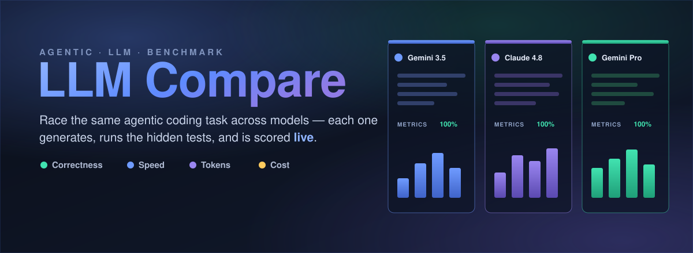
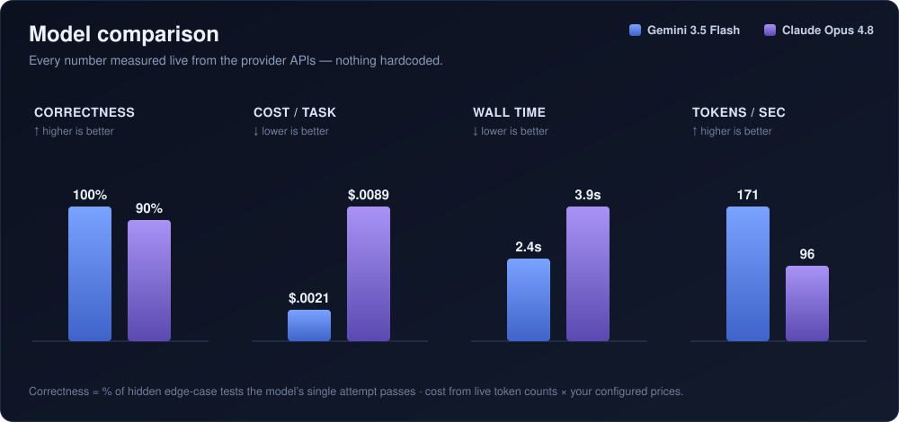
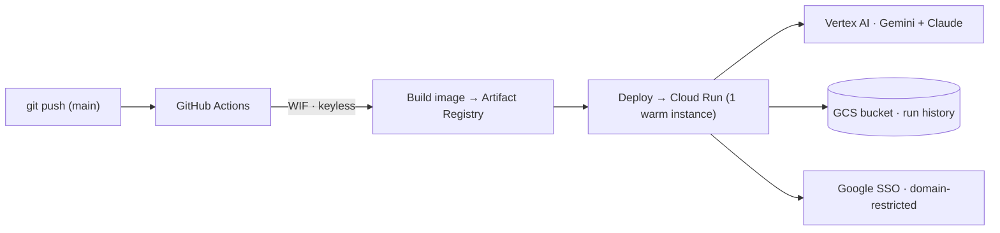
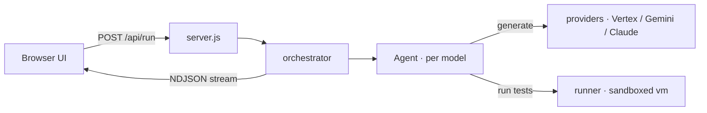

<p align="center">
  
</p>

<h1 align="center">LLM Compare</h1>

<p align="center">
  <b>Race the same agentic coding task across multiple LLMs and compare them on what a buyer actually cares about — correctness, speed, tokens, and cost — measured live.</b>
</p>

<p align="center">
  = 18">
  
  
  
</p>

---

**LLM Compare** sends the **same agentic coding task** to several LLMs at once. Each model writes a
solution, the harness runs it against **hidden edge-case tests** in a sandbox, and every model is
scored on the same axes — **correctness, cost, wall-time, and token throughput** — streamed to the
browser as it happens. It's a dependency-light Node/Express + vanilla-JS app that runs locally in one
command and deploys to **Google Cloud Run** with keyless CI.

### Why it's a credible demo, not a rigged one

Every number is **measured live** from the provider APIs — real latency, the token counts the APIs
return, and **your** configured prices. Correctness is the share of hidden edge-case tests the model's
attempt passes. Nothing is hardcoded, so a fast, low-cost model wins the cost and speed axes on its own
merits and the result holds up under scrutiny.

<p align="center">
  
</p>

## Features

- ⚡ **Live, parallel runs** — all models run concurrently; results stream token-by-token over NDJSON (thinking, per-round metrics, pass/fail).
- 🎯 **Single-shot correctness** — one attempt per model; correctness = % of hidden edge-case tests it passes.
- 📊 **Neutral scorecard** — per-metric vertical bars for correctness, cost, speed, and tokens. No hardcoded "winner".
- 🔒 **Locked model catalog** — users pick from a server-authoritative catalog (Gemini + Claude); prices and model IDs can't be tampered with from the browser.
- 🧩 **File-based tasks** — 16 tasks across **Business / Coding / Games / General**; add one by dropping a Markdown file in `prompts/`.
- 🕹️ **Runnable code & in-browser games** — coding tasks run against their tests; Pygame tasks (Mario, Pac-Man) build to WebAssembly via **pygbag** and play in the browser.
- 🗂️ **Per-user run history** — durable, server-side, per user; admins see everyone plus a usage dashboard.
- 🔑 **Bring-your-own-keys** — users can supply their own API keys (never persisted server-side); own-key runs skip the daily limit.
- ☁️ **Deploys to Cloud Run** — containerized, keyless CI (Workload Identity Federation), Google SSO, per-user daily run cap.

## Quickstart (local)

```bash
git clone https://github.com/UbhiTS/llm-compare.git
cd llm-compare
npm install
cp .env.example .env      # then fill in the values below
npm start                 # → http://localhost:8080
```

Minimum `.env` for the default (Gemini + Claude via Google Vertex) path:

```ini
AGENT_PLATFORM_API_KEY=your-gemini/agent-platform-api-key
GCP_PROJECT_ID=your-gcp-project-with-claude-enabled-in-vertex
```

- **Gemini** slots use `AGENT_PLATFORM_API_KEY`. **Claude** runs through Vertex AI — the server
  **auto-mints** a token from your `gcloud` login (`gcloud auth login`), so no key is needed as long as
  the project has the Anthropic models enabled in Vertex Model Garden.
- Login is always on. On first visit the server prints a one-time **SETUP CODE** in the console — use it
  to create the `admin` password. After that, sign in normally.
- No keys handy? `npm test` runs the whole loop against a mocked provider and checks the scoring.

## Deploy to your own Google Cloud

The app ships as a **container** and deploys to **Cloud Run** via a **GitHub Actions** pipeline that
authenticates to Google Cloud **keylessly** (Workload Identity Federation — no JSON keys). Org users
sign in with **Google (OIDC)**, restricted to your Workspace domain(s).



### Prerequisites

- A Google Cloud **project** with billing enabled, and the `gcloud` CLI installed & logged in.
- The Anthropic **Claude models enabled** in that project's **Vertex AI Model Garden**.
- A **GitHub** account and the `gh` CLI (or the web UI).
- A **Google Workspace domain** you control for org sign-in. ⚠️ Do **not** use `google.com` as the allowed
  domain unless you really intend to let every Google employee in.

### Fast path — one script + one manual step

1. **Provision everything** with the idempotent setup script. Open [`scripts/gcp-setup.sh`](scripts/gcp-setup.sh),
   set the variables at the top (`PROJECT_ID`, `GITHUB_OWNER`, `GITHUB_REPO`, `BILLING_ACCOUNT`, `ORG_ID`,
   your Workspace domain and admin email), then run it:

   ```bash
   bash scripts/gcp-setup.sh
   ```

   It creates the project + APIs, Artifact Registry, a **GCS bucket for durable history**, the runtime &
   deployer service accounts + IAM, **Workload Identity Federation**, and the three Secret Manager secrets
   (it prompts for their values). At the end it prints the exact `gh variable set` / `gh secret set`
   commands to configure the repo.

2. **Create the "Sign in with Google" OAuth client** (console-only — see
   [DEPLOYMENT.md Step 6](DEPLOYMENT.md)). Set the consent screen to **Internal**, create a **Web
   application** client, and add the redirect URI `https://YOUR-APP-URL/auth/google/callback`.

3. **Set the GitHub Variables & Secrets** (run the block the script printed), then fill in the two
   Google values: `GOOGLE_CLIENT_ID` (variable), `GOOGLE_CLIENT_SECRET` (Secret Manager), and
   `OAUTH_REDIRECT_BASE` (your public URL).

4. **Deploy** — push to `main` (or run the workflow manually):

   ```bash
   git push origin main
   ```

   The workflow builds the image, pushes it to Artifact Registry, and deploys to Cloud Run, printing the
   service URL. If you didn't know the URL when creating the OAuth client, add
   `https://<that-url>/auth/google/callback` now and re-run the workflow.

> **Full manual walkthrough & parameter reference:** [DEPLOYMENT.md](DEPLOYMENT.md).

### What gets deployed

| Piece | What it does |
|---|---|
| **Cloud Run** service | 1 warm instance (`--min/--max-instances=1`) so in-memory sessions + the per-user daily counter stay consistent. |
| **Runtime service account** | The app's identity — calls **Vertex AI** (Gemini + Claude) via ADC (no `gcloud`, no reauth) and reads secrets. |
| **GCS bucket** (`/data`) | Durable per-user **run history** that survives restarts. |
| **Secret Manager** | `AGENT_PLATFORM_API_KEY`, `GOOGLE_CLIENT_SECRET`, `ADMIN_BOOTSTRAP_PASSWORD` (break-glass admin login). |
| **Workload Identity Federation** | Lets GitHub Actions deploy with **no stored keys**. |

## Models & pricing

Users may only pick from a **server-authoritative catalog** in [`src/pricing.js`](src/pricing.js). Model
IDs, publisher, and per-token prices are locked there — the browser can add/remove catalog entries but
never edit their settings, and `/api/run` re-resolves whatever the client posts back through the catalog,
so a tampered price or model ID is ignored.

| Model | Publisher | Price in / out ($/1M) |
|---|---|---|
| Gemini 3.5 Flash | Google (Vertex) | 1.50 / 9.00 |
| Claude Opus 4.8 | Anthropic (Vertex) | 5.00 / 25.00 |
| Gemini 3.1 Pro | Google (Vertex) | 2.00 / 12.00 |

> Prices are the shipped defaults from public 2026 pricing. **Verify current prices** and edit
> `MODEL_CATALOG` before a customer demo. To add a model, add a catalog entry; to change the default
> slots shown on load, edit `DEFAULT_MODELS`.

## Tasks

16 tasks ship across four categories, loaded from Markdown files in [`prompts/`](prompts/):

- **Business** — retail replenishment, supply-chain disruption, churn/retention, workforce scheduling, incident postmortem, SOC 2 / GDPR readiness (prose, table-heavy demos).
- **Coding** — Wagner-Whitin lot sizing, critical-path scheduling, meeting rooms, word break, LIS, and a runnable Python Towers of Hanoi. Graded tasks seed tricky edge cases so a naive attempt fails.
- **Games** — Super Mario and Pac-Man clones (Pygame → WebAssembly, play in the browser).
- **General** — a Kansai travel itinerary and an 8-disk Hanoi enumeration (long-output stress).

**Add a task** = drop a `NN-your-task.md` file in `prompts/` (frontmatter + prompt body) and restart. See
[`prompts/README.md`](prompts/README.md) for the format. No code change needed.

## Configuration

All settings are environment variables, documented in [`.env.example`](.env.example). Highlights:

| Var | Purpose |
|---|---|
| `AGENT_PLATFORM_API_KEY` | API key for the Gemini (Vertex) slots. |
| `GCP_PROJECT_ID` | Project with Claude enabled in Vertex Model Garden. |
| `GOOGLE_CLIENT_ID` / `GOOGLE_CLIENT_SECRET` / `ALLOWED_EMAIL_DOMAINS` | Google org SSO. |
| `ADMIN_EMAILS` / `ADMIN_BOOTSTRAP_PASSWORD` | Admin role by email; durable break-glass admin login. |
| `MAX_RUNS_PER_DAY` | Per-user daily comparison cap (0 = unlimited). |
| `APP_DATA_DIR` | Where run history is stored (a mounted GCS bucket in the cloud). |
| `ENABLE_CODE_EXEC` / `ENABLE_WEB_GAME` | Toggle code execution and in-browser game builds. |

## How it works



| Path | Purpose |
|---|---|
| `server.js` | Express: serves the UI, `/api/config`, `/api/run` (NDJSON stream), `/api/execute`, auth + history APIs. |
| `src/orchestrator.js` | Runs the per-model agent loops concurrently. |
| `src/agent.js` | The per-model agent loop — generate → test (single attempt by default); accrues tokens / latency / cost. |
| `src/providers.js` | Vertex (Gemini + Claude) and direct Gemini/OpenAI/Anthropic adapters, normalized. |
| `src/runner.js` | Sandboxed (`vm`) JS test runner with a hard timeout. |
| `src/codeRunner.js` | Runs generated Python / JS on request (`/api/execute`). |
| `src/pricing.js` · `src/tasks.js` | Model catalog + prices · task loader (`prompts/`). |
| `public/` | The UI (vanilla JS, "Aurora Glass" theme). |

## Security & cost notes

- The test runner uses Node's `vm` for **isolation, not a security sandbox**; `/api/execute` runs
  model-generated code. Both are fine for the bundled tasks you control — don't point them at untrusted
  task definitions. Disable execution with `ENABLE_CODE_EXEC=0`.
- The deployed app is behind **Google SSO** and a per-user daily run limit. The single warm instance keeps
  cost to a few dollars/month; Vertex/Gemini usage is billed per token as normal.
- Keys never reach the browser — they're read only on the server, and `/api/config` returns booleans only.

## Testing

```bash
npm test    # offline: mocks the provider API and exercises the full loop + scoring
```

## License

No open-source license has been set yet — ask before reuse.
