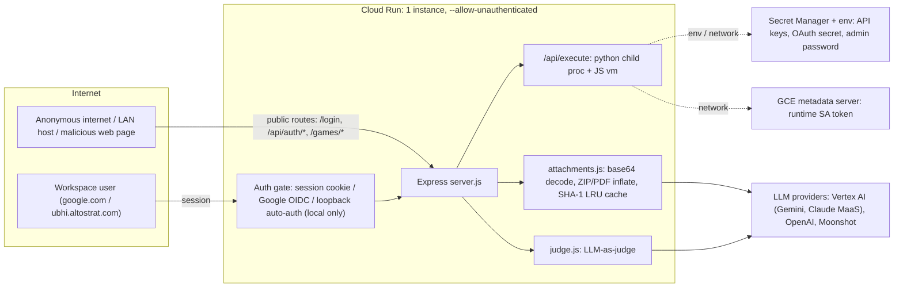

# LLM Compare — Security Audit & Production Hardening

**Date:** 2026-09-24 · **Auditor:** argolis (Tarun's Argolis PoC agent) · **Scope:** `projects/llm-compare` (local code only — no Cloud Run deploys, no GCP changes)
**Baseline commit:** `f6f1c4f` on `main` (tree was clean) · **Work branch:** `security-hardening-2026-09-24` (uncommitted changes. Review with `git diff`; revert with `git checkout main -- .`)

> [!IMPORTANT]
> **Result: 0 functional regressions.** `npm test` passes before and after (3/3 suites), the new HTTP smoke suite shows **22/22 identical status codes and response shapes**, and live Gemini 3.5 Flash / Flash-Lite compare + judge + cached-attachment runs pass before and after. Headless Chrome loads the same UI state on both builds.

---

## 1. Baseline (before any change)

| Check | Command | Result |
|---|---|---|
| Git state | `git status` | clean, `main` = `origin/main` = `f6f1c4f` |
| Unit / e2e tests | `npm test` (mock-run, verify-enhancements, verify-local-e2e) | ✅ all pass (exit 0) |
| Lint / build | — | none defined in `package.json` (no lint or build step) |
| HTTP smoke (new) | `node test/smoke-http.js` | ✅ 22/22 functional checks |
| Live smoke | `SMOKE_LIVE=1 node test/smoke-http.js` | ✅ `/api/run` NDJSON (`quota,start,status,delta,metrics,iteration,done,all_done`), `/api/judge` 200, cached-SHA-1 attachment run 200 |
| Dependencies | `npm audit --omit=dev` (public registry. The corp airlock proxy doesn't support audit) | ⚠ 2 moderate (`body-parser@1.20.5`, `qs@6.15.2`) |
| `npm outdated` | | `express 4.22.3` (latest 5.2.1), `dotenv 16.6.1` (latest 18.0.3). Both are major bumps, so we didn't take them |

Baseline endpoint shapes that were recorded and re-checked after the fixes:

| Endpoint | Status | Shape |
|---|---|---|
| `GET /login` | 200 | HTML |
| `GET /api/auth/status` | 200 | `{allowedDomains,authenticated,googleAuth,setupRequired,user}` |
| `POST /api/auth/login` (bad creds) | 401 | `{error}` |
| `GET /api/config` | 200 | `{allowedDomains,catalog,codeExec,gcpProject,keysPresent,maxRunsPerDay,maxSingleRunsPerDay,me,models,tasks,webGame}` |
| `GET /api/history` | 200 | `{runs,scope}` |
| `GET /api/history/:id` (unknown / traversal) | 404 | `{error}` |
| Invalid JSON body | 400 | `{error,type}` |
| `POST /api/attachments/inspect` (CSV, PNG, ZIP, PDF, empty) | 200 | `{cached,estimatedTokens,extractedChars,isEmpty,isEncrypted,isScannedOrImageOnly,kind,mimeType,name,pageCount,pdfMeta,sha1,size,warning}` |
| `POST /api/judge` (bad judge / <2 entries) | 400 | `{error}` |
| `POST /api/execute` python / JS (LIS 10/10) / ruby | 200 / 200 / 400 | `{durationMs,exitCode,kind,stderr,stdout,timedOut,truncated}` / `{kind:'tests',passed,total,failing,durationMs}` |
| `GET /games/<bad>/` | 404 | — |

---

## 2. Threat model (summary)

| Asset | Where | Primary threats |
|---|---|---|
| Provider API keys, `GOOGLE_CLIENT_SECRET`, `ADMIN_BOOTSTRAP_PASSWORD`, gcloud token cmd | env / Secret Manager / `.env` (git-ignored ✓) | exfiltration through executed code, logs, image layers |
| Runtime service-account token | metadata server | executed code reaching `169.254.169.254` |
| Admin session / auto-admin | `auth.js`, loopback auto-auth | auth bypass |
| Per-user run history (prompts + outputs) | `.data/` locally, GCS FUSE in cloud | IDOR, image leakage |
| Service availability (max-instances=1, 1 GiB) | whole app | memory/CPU DoS (bombs, huge bodies, host hangs) |
| Judge integrity | `judge.js` | prompt injection from model outputs / attachments |

**Entry points:** 6 public routes (`/login`, `/api/auth/{status,setup,login}`, `/auth/google/*`, `/privacy`, `/terms`, `/games/:id/*`) and about 15 authenticated APIs. **Trust boundaries:** browser ↔ server (JSON bodies, attachments, BYO keys), server ↔ executed code (python/vm), server ↔ LLM (untrusted model output rendered in the UI and fed to the judge).

**What's already done well (no action needed):** scrypt + timing-equalised login, opaque server-side sessions, `HttpOnly; SameSite=Strict; Secure` cookies, per-IP/user lockout, OIDC `state` + `iss`/`aud`/`email_verified`/`hd` checks, server-authoritative model catalog (the client can't spoof price or model), history `safeId()` + owner checks, `/games` path-traversal guard, a strict CSP with no `unsafe-inline` scripts, and all frontend `innerHTML` sinks escaping data with `esc()`. CORS isn't enabled (same-origin only), which is correct for this app.

---

## 3. Scanner / tooling coverage

| Skill | Outcome |
|---|---|
| `run_security_scanner` | SecureCoder API **not running** (`~/.securecoder/api.json` and `$SECURECODER_API_PORT` absent). The skill says to skip in that case. **Mitigation:** we manually audited every file in scope (`server.js`, `src/*.js` ×15, `public/app.js`, `index.html`, `login.html`, Dockerfile, deploy workflow). |
| `scan_dependencies` | Skipped for the same reason. **No new packages were added**, so there was nothing to approve. We ran `npm audit` against the public registry instead. |
| `npm audit --omit=dev` | 2 moderate → **0** after `npm audit fix` (lockfile-only patch bumps) |
| Dynamic probes | `test/smoke-http.js` security probes (pre-fix: 5 vulnerable, post-fix: 0) |
| Differential test | old (`git show f6f1c4f`) vs new modules: runner 17/17 identical, attachments 8/8 identical |

---

## 4. Findings

Severity uses CVSS-style judgement in the context of the actual deployment: public Cloud Run URL, `ALLOWED_EMAIL_DOMAINS` includes `google.com`, and local runs bind `0.0.0.0` by default.

| ID | Sev | File:line (post-fix) | Description | Status | Verification |
|---|---|---|---|---|---|
| **CS-AUTHN-001** | **Critical** (local) | [server.js:232](file:///Users/ubhi/WorkIQ/projects/llm-compare/server.js#L232), [server.js:256](file:///Users/ubhi/WorkIQ/projects/llm-compare/server.js#L256) | Loopback auto-auth trusted the **client-supplied `Host` header** (`startsWith('localhost')`). Any LAN device could send `Host: localhost` and become **admin** on Tarun's laptop, then chain to `/api/execute` for unauthenticated RCE. DNS-rebinding pages (loopback peer + foreign Host) and local tunnels/reverse proxies were also auto-admin. Not exploitable on Cloud Run (`K_SERVICE` set). | **Fixed** | Probes SEC-01 200→**401**, SEC-01c 200→**401**; localhost UI and `npm test` e2e unchanged |
| **CS-RCE-002** | **High** | [runner.js:97](file:///Users/ubhi/WorkIQ/projects/llm-compare/src/runner.js#L97) | JS test runner `vm` sandbox escape: `this.constructor.constructor('return process')()` returned the **host `process`**, giving full RCE inside the main Node process (all secrets in memory, sessions, `require('child_process')`). Reachable by any authenticated user through `/api/execute`, and indirectly by prompt-injected model output in graded JS tasks. | **Fixed** (null-prototype context) | SEC-02 `"number"`→**`"blocked"`**; 17/17 solutions give identical results |
| **CS-DOS-003** | Medium | [runner.js:43-67](file:///Users/ubhi/WorkIQ/projects/llm-compare/src/runner.js#L43-L67), [runner.js:83](file:///Users/ubhi/WorkIQ/projects/llm-compare/src/runner.js#L83) | The host read sandbox objects (`r.ok`, `JSON.stringify(r.got)`, `e.message`) **outside the vm timeout**. A getter or Proxy in model code could hang the single Cloud Run instance forever. | **Fixed** (results serialised inside the vm; safe error extraction) | Getter-DoS returns in 502 ms (timeout) instead of hanging |
| **CS-SECRET-004** | **High** | [codeRunner.js:40](file:///Users/ubhi/WorkIQ/projects/llm-compare/src/codeRunner.js#L40) | `/api/execute` Python inherited the **full server env**: `AGENT_PLATFORM_API_KEY`, `OPENAI_API_KEY`, `GOOGLE_CLIENT_SECRET`, `ADMIN_BOOTSTRAP_PASSWORD`, `GCLOUD_TOKEN_CMD`… Any Workspace user could `print(os.environ)`. | **Fixed** (secret-named vars stripped; configurable `EXEC_ENV_DENY` / `EXEC_ENV_ALLOW`) | SEC-03 5 secret names → **`[]`**; python program output identical |
| **CS-RCE-005** | **High** (by design) | [server.js:430](file:///Users/ubhi/WorkIQ/projects/llm-compare/server.js#L430), [codeRunner.js](file:///Users/ubhi/WorkIQ/projects/llm-compare/src/codeRunner.js) | `/api/execute` runs **arbitrary client-supplied Python** on the server. On Cloud Run that code can still reach the **metadata server → runtime SA token → Secret Manager/Vertex**, the network, and `/data` (GCS FUSE history of all users). On a laptop it can reach `~/.config/gcloud`. It's a product feature, so it isn't disabled here. | **Open, needs Tarun's decision** | See §7 D1 |
| **CS-DOS-006** | Medium | [attachments.js:31](file:///Users/ubhi/WorkIQ/projects/llm-compare/src/attachments.js#L31), [:225](file:///Users/ubhi/WorkIQ/projects/llm-compare/src/attachments.js#L225), [:339](file:///Users/ubhi/WorkIQ/projects/llm-compare/src/attachments.js#L339) | **ZIP/PDF decompression bomb**: `inflateRawSync` / `inflateSync` had no output cap. A 199 KB upload inflated to 200 MB (+847 MB RSS measured). A few in parallel would OOM the 1 GiB instance. | **Fixed** (32 MB cap via `maxOutputLength`, prefix fallback keeps leading text; `ATTACHMENT_MAX_INFLATE_MB`) | Differential: RSS +847 MB → ~0, output identical (2.5 M chars); fixtures 8/8 identical |
| **CS-DOS-007** | Low | [attachments.js:200](file:///Users/ubhi/WorkIQ/projects/llm-compare/src/attachments.js#L200) | ZIP walker kept inflating entries after the 2.5 M-char output limit was already reached (CPU/memory amplification). | **Fixed** (early stop; result provably identical) | 400-entry ZIP fixture identical |
| **CS-DOS-008** | Medium | [attachments.js:418](file:///Users/ubhi/WorkIQ/projects/llm-compare/src/attachments.js#L418) | SHA-1 attachment LRU cache was bounded only by count (50). 50 × 25 MB base64 ≈ 1.7 GB exceeds the 1 GiB instance. | **Fixed** (added 512 MB byte budget, `ATTACHMENT_CACHE_MAX_MB`) | Live cached-sha1 run passes |
| **CS-DOS-009** | Medium | [server.js:91-94](file:///Users/ubhi/WorkIQ/projects/llm-compare/server.js#L91-L94), [:248](file:///Users/ubhi/WorkIQ/projects/llm-compare/server.js#L248) | The 50 MB JSON parser ran **before authentication**, so anonymous internet clients could make the public service buffer and parse 50 MB bodies on any path. | **Fixed** (64 KB parser for `/api/auth/{login,setup}`; 50 MB only after the auth gate; `PUBLIC_JSON_LIMIT` / `JSON_BODY_LIMIT`) | SEC-06 401 (parsed) → **413**; login 401 shape unchanged |
| **CS-PI-010** | Medium | [judge.js:107](file:///Users/ubhi/WorkIQ/projects/llm-compare/src/judge.js#L107), [:130](file:///Users/ubhi/WorkIQ/projects/llm-compare/src/judge.js#L130) | **Judge prompt injection**: model outputs and attachments could forge `----- Response B -----` / `=== HOW TO SCORE ===` sections or instruct the judge to score themselves 10. | **Fixed (mitigated)**: forged delimiters defanged (length-preserving), explicit "untrusted DATA" instruction. LLM judges can't be made fully injection-proof. | Live judge 200, same shape |
| **CS-INPUT-011** | Low | [judge.js:201](file:///Users/ubhi/WorkIQ/projects/llm-compare/src/judge.js#L201) | Judge JSON with non-array `scores` / null entries threw a `TypeError` (the run failed). | **Fixed** | — |
| **CS-XSS-012** | Medium | [app.js:3116](file:///Users/ubhi/WorkIQ/projects/llm-compare/public/app.js#L3116) | Markdown modal **failed open**: if the DOMPurify CDN script didn't load but `marked` did, raw LLM HTML went into `innerHTML`. CSP blocks inline JS, but HTML/CSS injection (phishing forms, UI redress) was still possible. | **Fixed** (render HTML only when DOMPurify exists; otherwise raw text) | Headless Chrome: `` / `<script>` stripped, `__pwn=0` |
| **CS-SUPPLY-013** | Medium | [index.html:14-16](file:///Users/ubhi/WorkIQ/projects/llm-compare/public/index.html#L14-L16) | CDN scripts used **floating versions** (`marked@12`, `dompurify@3`) with **no SRI**. A CDN or package compromise would give script execution in the app origin. | **Fixed** (pinned to the exact files the tags resolve to today: marked 12.0.2, DOMPurify 3.4.16, Chart.js 4.4.1, plus `integrity` and `crossorigin`) | Hashes computed twice per URL (stable); headless Chrome: `marked`/`DOMPurify`/`Chart` all load, 18 task options, identical to baseline |
| **CS-XSS-014** | Low | [app.js:2291](file:///Users/ubhi/WorkIQ/projects/llm-compare/public/app.js#L2291), [:2377](file:///Users/ubhi/WorkIQ/projects/llm-compare/public/app.js#L2377) | Server quota message went into `innerHTML` unescaped (server-controlled today, defense-in-depth). | **Fixed** (`esc()`, renders identically) | — |
| **CS-DEP-015** | Medium | `package-lock.json` | `body-parser ≤1.20.6` (GHSA-v422-hmwv-36x6) and `qs ≤6.15.3` (GHSA-x5fp-wj9c-mxmx, GHSA-4mjr-xmp4-gh2g). Not directly exploitable with our valid `limit`, but patched anyway. | **Fixed** (`npm audit fix`: body-parser 1.20.8, qs 6.16.0; lockfile only) | `npm audit`: 0 vulns; all tests pass |
| **CS-LEAK-016** | Medium | [.dockerignore](file:///Users/ubhi/WorkIQ/projects/llm-compare/.dockerignore) | `.data/` (local run history with prompts/outputs) was **not** excluded from the Docker build context, so it got baked into Artifact Registry images. `demospace/` media (8 MB) bloated the image. | **Fixed** (excluded `.data`, `demospace`, `docs`, `test`, `click-to-deploy`) | Runtime reads only `public/`, `prompts/`, `src/` |
| CS-AUTHZ-017 | Medium | [server.js:454](file:///Users/ubhi/WorkIQ/projects/llm-compare/server.js#L454), [:577](file:///Users/ubhi/WorkIQ/projects/llm-compare/server.js#L577) | No rate or concurrency limits on Vertex-backed `/api/run`, `/api/judge`, `/api/execute`, `/api/web-game`, `/api/attachments/inspect` for about 200k `google.com` users. This is a cost and DoS risk. | **Open, needs Tarun's decision** (D2) | — |
| CS-CONF-018 | Low | [providers.js:389](file:///Users/ubhi/WorkIQ/projects/llm-compare/src/providers.js#L389), [:781](file:///Users/ubhi/WorkIQ/projects/llm-compare/src/providers.js#L781), [:939](file:///Users/ubhi/WorkIQ/projects/llm-compare/src/providers.js#L939) | Gemini/Vertex API key sent as `?key=` query param (can land in proxy logs). Prefer the `x-goog-api-key` header. | Open (recommendation R6; touches the 57 KB provider layer) | — |
| CS-INTEG-019 | Low (integrity) | [providers.js:495](file:///Users/ubhi/WorkIQ/projects/llm-compare/src/providers.js#L495), [:655-662](file:///Users/ubhi/WorkIQ/projects/llm-compare/src/providers.js#L655-L662), [:864](file:///Users/ubhi/WorkIQ/projects/llm-compare/src/providers.js#L864) | **Silent model substitution** on 404/429: OpenAI slots fall back to `gpt-6-sol`/`gpt-6-astra`/`gpt-oss-120b` **without a UI note**, and are priced as the original model. Claude falls back to Opus 5.5 with a note. This is a credibility risk for customer benchmarks. | **Open, needs Tarun's decision** (D4) | — |
| CS-CONF-020 | Low | Dockerfile | Base image not digest-pinned. `npm ci … \|\| npm install` hides lockfile drift. No `HEALTHCHECK`/startup probe. Non-root `USER node` ✓, tini ✓. | Open (R8) | — |
| CS-HDR-021 | Info | [server.js:52-73](file:///Users/ubhi/WorkIQ/projects/llm-compare/server.js#L52-L73) | `frame-ancestors *` and no XFO when `Host` is `localhost`. A victim's browser can't forge Host, so this isn't exploitable remotely. | False positive / accepted | — |
| CS-SSRF-022 | Info | [providers.js:838-840](file:///Users/ubhi/WorkIQ/projects/llm-compare/src/providers.js#L838-L840) | User-supplied `keys.gcpProject` goes into Vertex URLs, but it's `encodeURIComponent`-escaped and the host is fixed. No SSRF or path injection. | False positive | Code trace |
| CS-XSS-023 | Info | app.js (≈45 `innerHTML` sinks) | All data-bearing sinks use `esc()`. Iframe `src` is a server-built `/games/<sha256-hex16>/`. `login.html` uses `textContent` for the OAuth error. | False positive | Manual review |
| CS-MODEL-024 | Info | [pricing.js:38-43](file:///Users/ubhi/WorkIQ/projects/llm-compare/src/pricing.js#L38-L43) | No legacy Gemini 1.5/2.0/2.5 IDs anywhere ✓. The catalog also includes **Gemini 3.8 Flash (default slot A)** and **3.6 Flash**, which are outside the approved Argolis list (3.7 Flash, 3.5 Flash, 3.5 Flash-Lite, 3.1 Pro). Left unchanged because they're live in the demo. | Recommendation (D5) | — |

**Counts:** Critical 1 (fixed 1) · High 3 (fixed 2, open 1) · Medium 10 (fixed 9, open 1) · Low 6 (fixed 3, open 3) · Info 4 (3 false positive, 1 recommendation). **Total real findings 20: 15 fixed, 5 open** (all 5 need a decision or are out-of-scope refactors).

---

## 5. Diff summary (every change)

`git diff --stat`: 10 files, about 190 insertions and 60 deletions, plus a new `test/smoke-http.js`. No API contract, response shape, model-selection or UI-behaviour changes. **No new dependencies.**

| File | Change | New env knobs (defaults preserve behaviour) |
|---|---|---|
| `server.js` | `isLocalAutoAuthRequest()`: real TCP peer must be loopback, Host must be loopback (or the Antigravity sidecar env, or an allowlist), no `X-Forwarded-For`/`Forwarded`. 50 MB JSON parser moved behind the auth gate; 64 KB parser for login/setup; shared `jsonBodyError` handler (same 413/400 bodies). | `LOCAL_AUTO_AUTH_HOSTS`, `PUBLIC_JSON_LIMIT=64kb`, `JSON_BODY_LIMIT=50mb` |
| `src/runner.js` | Null-prototype vm context. Results serialised to a JSON string inside the vm and returned as the script's completion value. `safeErrorMessage()` never triggers sandbox getters or Proxy traps. | — |
| `src/codeRunner.js` | `childEnv()` strips `*KEY*`/`*TOKEN*`/`*SECRET*`/`*PASSWORD*`/`*CREDENTIAL*`/`*BEARER*`/`*PRIVATE*`, `SSH_AUTH_SOCK`, `GCLOUD_TOKEN_CMD` from the python env (headless and GUI). Keeps PATH, HOME, DISPLAY, XAUTHORITY, proxies, locale. | `EXEC_ENV_DENY`, `EXEC_ENV_ALLOW` |
| `src/attachments.js` | `boundedInflate()` for ZIP and PDF streams (cap plus prefix fallback). ZIP walker early stop. Byte-budgeted LRU cache. | `ATTACHMENT_MAX_INFLATE_MB=32`, `ATTACHMENT_CACHE_MAX_MB=512` |
| `src/judge.js` | `defangDelimiters()` (length-preserving) plus an untrusted-data instruction. Safe `scores` parsing. | — |
| `public/app.js` | Markdown renders as HTML only when DOMPurify is loaded. `esc()` on the quota message (×2). | — |
| `public/index.html` | Exact-version CDN URLs with `integrity` and `crossorigin="anonymous"`. | — |
| `.dockerignore` | Excludes `.data`, `demospace`, `docs`, `test`, `click-to-deploy`, `SECURITY_AUDIT.md`. | — |
| `package-lock.json` | body-parser 1.20.5→1.20.8, qs 6.15.2→6.16.0 (patch, same semver ranges). | — |
| `package.json` | Added `"test:smoke": "node test/smoke-http.js"` (opt-in; `npm test` and CI unchanged). | — |
| `test/smoke-http.js` *(new)* | Black-box HTTP regression and security-probe suite (spawns the real server on port 18765 with isolated data dir). | `SMOKE_LIVE=1`, `SMOKE_JSON`, `SMOKE_PORT` |

> [!NOTE]
> **Behaviour change to know about (local only):** auto-admin now applies only when you browse via `localhost`, `127.0.0.1` or `[::1]` on the same machine. Opening the app on the laptop via the LAN IP or a custom hostname now shows the normal login. Add hostnames with `LOCAL_AUTO_AUTH_HOSTS=myhost.local`. Antigravity sidecar mode (`ANTIGRAVITY_SIDECAR_WEB_PORT`) keeps its previous behaviour for loopback peers.

---

## 6. Before / after verification (zero regressions)

| Suite | Baseline (`f6f1c4f`) | After (hardened) |
|---|---|---|
| `npm test`: mock-run | ✅ ALL CHECKS PASSED | ✅ ALL CHECKS PASSED |
| `npm test`: verify-enhancements (7 checks) | ✅ 7/7 | ✅ 7/7 |
| `npm test`: verify-local-e2e (6 checks incl. live HTTP quota 429) | ✅ 6/6 | ✅ 6/6 |
| `test/smoke-http.js` functional (same final script run on both via `git worktree`) | ✅ 22/22 | ✅ 22/22, **0 diffs** in status/shape |
| Live: `/api/run` Gemini 3.5 Flash, `/api/judge` 3.5 Flash-Lite, cached-SHA-1 attachment run | ✅ 3/3 | ✅ 3/3 |
| Headless Chrome (CDP): libs loaded / task options / markdown sanitised | marked ✓ DOMPurify ✓ Chart ✓ / 18 / `__pwn=0` | marked ✓ DOMPurify ✓ Chart ✓ / 18 / `__pwn=0` (identical) |
| Differential: `runTests` on 17 candidate solutions (correct, wrong, throw, Promise, infinite loop, BigInt, cycles, strict mode, syntax error…) | reference | **17/17 identical** |
| Differential: `normalizeAttachments` on 8 fixtures (CSV, 60k-para DOCX, 400-entry ZIP, PDF, PNG, binary, empty, provided text) | reference | **8/8 identical** |
| `npm audit --omit=dev` | 2 moderate | **0** |

**Security probes** (from `test/smoke-http.js`; the vm/env probes were also traced per the run_poc skill):

| Probe | Baseline | After |
|---|---|---|
| SEC-01 LAN host spoofs `Host: localhost` → `/api/config` | **200 (admin)** ❌ | 401 ✅ |
| SEC-01b LAN host spoofs `X-Forwarded-For: 127.0.0.1` | 401 | 401 |
| SEC-01c DNS rebinding (loopback peer, `Host: rebind.attacker.example`) | **200 (admin)** ❌ | 401 ✅ |
| SEC-02 vm escape `this.constructor.constructor('return process')()` | **`"number"` (host pid)** ❌ | `"blocked"` ✅ |
| SEC-03 secret env names visible to executed python | **5 names** ❌ | `[]` ✅ |
| SEC-04 ZIP bomb 199 KB → 200 MB | 180 ms, +847 MB RSS ❌ | 50 ms, ~0 MB ✅ |
| SEC-06 anonymous 8 MB body to `/api/auth/login` | **parsed (401)** ❌ | 413 ✅ |
| vm getter host-hang (`get x(){while(1){}}`) | hangs host (not run; would block the process) | returns in 502 ms (vm timeout) ✅ |

### PoC reasoning (run_poc skill) for High/Critical fixes

- **CS-AUTHN-001:** The exploit is `curl -H 'Host: localhost' http://<laptop-LAN-IP>:8080/api/config`. After the fix, `isLocalAutoAuthRequest` reads `req.socket.remoteAddress` (the LAN IP, which isn't loopback) and returns false. The Host header is never consulted for non-loopback peers. For DNS rebinding, the peer is loopback but Host is `rebind.attacker.example`, which isn't in the loopback set, so it returns false. The gate then falls through to `401`. **Exploit fails. Verified by probe.**
- **CS-RCE-002:** The exploit is code posted to `/api/execute` with `taskId:'lis'`. After the fix, the global object is backed by `Object.create(null)`, so `this.constructor` resolves through the context's own `Object.prototype`, giving the context `Function`, which has no `process` binding. The call throws `ReferenceError`. Known alternatives (error `.constructor`, arrow `this`, `globalThis`) were tested and also resolve in-context. The host never touches sandbox objects (it only receives a JSON string). **Exploit fails. Verified by probe and differential test.**
- **CS-SECRET-004:** The exploit is `print(os.environ)`. `childEnv()` removes secret-named variables before `spawn`, so the child process never receives them. **Residual risk:** metadata-server token (see D1).

---

## 7. Decisions needed from Tarun (not guessed)

| # | Decision | Why | Options |
|---|---|---|---|
| **D1** | **Server-side code execution on Cloud Run** (`/api/execute` python) | Any allowed-domain user (all of `google.com`) can run arbitrary Python next to the runtime SA token (metadata server) and the shared `/data` history bucket. Env secrets are now stripped, but the SA token isn't. | (a) Set `ENABLE_CODE_EXEC=0` on Cloud Run (the browser WASM game path still works). (b) Move execution to a separate zero-permission Cloud Run service / gVisor sandbox with egress blocked. (c) Restrict `/api/execute` to `role=admin`. **Recommended: (a) now, (b) later.** |
| **D2** | **Rate/concurrency limits** on Vertex-backed endpoints | Unlimited Gemini/Claude on a public URL for ~200k Googlers; 1 instance / 1 GiB. | Per-user in-memory limiter (e.g. 2 concurrent runs, N/hour) with env overrides, zero deps. Or narrow `ALLOWED_EMAIL_DOMAINS` to `ubhi.altostrat.com` plus an explicit allowlist. |
| **D3** | **Public auth surface**: `--allow-unauthenticated` plus username/password plus break-glass admin | Consider fronting with IAP (Workspace SSO at the edge) and disabling password login in the cloud. | IAP, or keep as is. |
| **D4** | **Silent model fallback** (CS-INTEG-019) | A customer could see "GPT-6 Terra" results actually produced by another model and priced as Terra. | Surface a routed-model note in the UI (like the Claude path) or disable fallback during benchmarks. |
| **D5** | **Model IDs**: default slot A is Gemini 3.8 Flash; 3.6 Flash is also in the catalog | Outside the approved Argolis list. Not changed, to avoid breaking the live demo. | Keep, or switch the default to Gemini 3.7 Flash after verifying against current Vertex AI docs. |
| **D6** | **Commit / merge** | Changes are on branch `security-hardening-2026-09-24` (committed locally as `4528ce4` + `cab86c9`, not pushed). Merging to `main` **triggers the GitHub Actions deploy to Cloud Run**. | Review the diff, then commit and merge when ready. |

> [!WARNING]
> Tarun's **currently running local server** (PID 48469, started 16:12, port 3000, bound to `0.0.0.0`) is still the **pre-fix code** and is exposed to CS-AUTHN-001 on the LAN until you restart it.

---

## 8. Optimisation & production-readiness recommendations (prioritised)

Only trivially safe items were implemented (lockfile patch, `.dockerignore` slimming, bounded cache and inflate). Everything else is a recommendation.

| # | Area | Recommendation | Impact / effort |
|---|---|---|---|
| **R1** | Reliability / cost | **Upstream timeouts + bounded retries with jitter.** Provider `fetch` calls only abort on client disconnect, so a hung upstream holds a slot until Cloud Run's 3600 s timeout. Add `AbortSignal.any([clientSignal, AbortSignal.timeout(UPSTREAM_TIMEOUT_MS)])` (env, default off or generous for 1M-token runs) and 1–2 retries on 429/503 with exponential backoff instead of silent model substitution. | High / S |
| **R2** | Reliability | **Attachment cache miss currently becomes a silent "empty file"** ([attachments.js normalize fast-path](file:///Users/ubhi/WorkIQ/projects/llm-compare/src/attachments.js#L438-L452)): after an instance restart or eviction, a `{sha1,name}` reference is sent to models as a 0-byte file. Return a `missing:true` flag or a `409` so the UI re-uploads full data. Also switch the cache key to SHA-256 (SHA-1 is collision-prone; the cache is shared across users). | High / S–M |
| **R3** | Cost | **Judge tiering**: default the judge to Gemini 3.5 Flash-Lite / 3.5 Flash for business tasks and reserve 3.1 Pro for close calls (score delta < 1). Cap judge input with `budgetFor()` at about 30% of context rather than 55% for Flash-tier judges. | High / S |
| **R4** | Performance / UX | `/api/attachments/inspect` and `/api/run` do synchronous ZIP/PDF parsing on the event loop, which stalls every user's NDJSON stream on the single instance. Move extraction into a `worker_threads` pool (zero deps) and stream uploads (multipart) instead of 50 MB base64 JSON (+33% payload, double buffering). | High / M |
| **R5** | Observability | Structured JSON logs (`severity`, `user`, `runId`, `model`, `latencyMs`, `tokens`, `costUsd`) for Cloud Logging, a `/healthz` endpoint plus a Cloud Run startup probe, graceful `SIGTERM` drain (finish NDJSON runs, flush history SQLite). | Med / S |
| R6 | Security hygiene | Send Gemini/Vertex API keys via the `x-goog-api-key` header instead of `?key=` (CS-CONF-018). | Med / S |
| R7 | Frontend | `app.js` is 154 KB (3.1k lines) and `styles.css` is 77 KB, unminified and served `no-store`. Serve hashed filenames with `Cache-Control: public, max-age=31536000, immutable`, keep `index.html` `no-store`, and minify (esbuild as a dev-dep, which needs a scan_dependencies check). Self-host `marked`/`DOMPurify`/`Chart.js` to drop the CDN trust entirely. | Med / M |
| R8 | Container / CI | Pin `node:22-bookworm-slim@sha256:…`. Use `npm ci --omit=dev` only (fail on drift). Add `npm audit --omit=dev --audit-level=high` and `node test/smoke-http.js` to the workflow **before** deploy. Add a Dependabot/Renovate config. | Med / S |
| R9 | Code quality | ZIP extractor ignores entries using data descriptors (`compressedSize=0`, common in macOS/Java zips). Parse the central directory for robust DOCX/XLSX extraction. | Low / M |
| R10 | Local dev | Default `HOST` to `127.0.0.1` when `K_SERVICE` is unset (LAN exposure opt-in via `HOST=0.0.0.0`). The secondary `:3000` listener doubles the attack surface; make it opt-in. | Low / S |

---

## 9. Remaining risks

1. **Arbitrary Python execution on Cloud Run** (D1): the SA token and shared history bucket are still reachable from executed code.
2. **Cost/DoS abuse** of unlimited Vertex endpoints by authenticated users (D2).
3. **LLM-judge manipulation** can be reduced but not eliminated. Treat judge scores as advisory.
4. The **`vm` module is still not a security boundary.** The classic escape is closed, but a determined attacker may find V8/vm escapes. Moving JS grading to a child process (like Python) is the durable fix.
5. The SecureCoder scanner couldn't run (extension offline), so re-run it when available to catch anything the manual review missed.

---

## 10. Follow-up (2026-09-25): approved items D1, D4, D5, O1, O2, O4, O5

Same branch (`security-hardening-2026-09-24`), same zero-regression process. Nothing is merged to `main` (a merge deploys) and no files were deleted. There are two local commits: `4528ce4` (phase 1) and `cab86c9` (this follow-up).

### 10.1 What changed

| Item | Change | Files |
|---|---|---|
| **D1** | `ENABLE_CODE_EXEC=0` added to the Cloud Run env in the deploy workflow. `/api/config` now keeps **GUI (Pygame) tasks runnable** while exec is off, because they build to WASM via `/api/web-game` and run in the user's browser. Before this, exec-off hid the game Run buttons. Non-GUI tasks lose Run (by design); hidden-test scoring is unaffected (it uses `runner.js`). | [server.js](file:///Users/ubhi/WorkIQ/projects/llm-compare/server.js), [deploy.yml](file:///Users/ubhi/WorkIQ/projects/llm-compare/.github/workflows/deploy.yml) |
| **D4** | Removed every **silent OpenAI model substitution**: `gpt-6-terra→gpt-6-astra`, any→`gpt-6-sol` on 404/429, and the streaming re-route to `openai/gpt-oss-120b-maas`. A 404/429 now fails **that slot** with a labelled error naming the requested model and saying it was "not re-routed". The failed slot is unpriced; other slots and the judge are unaffected. Same-model 400/403 retries are kept. The Claude quota router is out of scope: it re-routes to Opus 5.5 but visibly (see 10.4). | [providers.js](file:///Users/ubhi/WorkIQ/projects/llm-compare/src/providers.js) |
| **D5** | Verified, no change (see 10.3). | — |
| **O1** | New `providerFetch()` for every upstream model call. **Timeout covers response headers only**, so streamed bodies are never cut off. Retries only on **429 / 5xx / network / header timeout**, using exponential backoff with full jitter and honouring `Retry-After`. Never retries other 4xx or client aborts. Configurable per provider through `PROVIDER_TIMEOUT_MS[_GEMINI\|_OPENAI\|_ANTHROPIC\|_MOONSHOT]` (default 900 s to first byte), `PROVIDER_MAX_RETRIES` (2), `PROVIDER_RETRY_BASE_MS` (1000) and `PROVIDER_RETRY_MAX_MS` (20000). | [providerFetch.js](file:///Users/ubhi/WorkIQ/projects/llm-compare/src/providerFetch.js) |
| **O2** | The cache is keyed by **SHA-256**, with a SHA-1 alias index so older clients' `{sha1}` references keep resolving. A reference-only item that misses the cache now throws `ATTACHMENT_EXPIRED`, which becomes **HTTP 409** `{code, expired:[…]}` on `/api/run` and `/api/judge`. That check happens **before quota is consumed**, and an empty file is never sent. The UI clears `cached` on the expired files and **re-uploads the full bytes once, automatically**. If the bytes aren't held locally it shows "please re-attach". `inspect` now also returns `sha256`. | [attachments.js](file:///Users/ubhi/WorkIQ/projects/llm-compare/src/attachments.js), [server.js](file:///Users/ubhi/WorkIQ/projects/llm-compare/server.js), [app.js](file:///Users/ubhi/WorkIQ/projects/llm-compare/public/app.js) |
| **O4** | PDF/ZIP/Office extraction runs in a **`worker_threads` pool**: `ATTACHMENT_WORKERS`=2, per-worker heap cap `ATTACHMENT_WORKER_HEAP_MB`=256, and a 30 s timeout that recycles the worker. It runs the same extractor code, so the inflate caps are unchanged. If a worker fails, extraction falls back to inline. New **multipart** endpoint `POST /api/attachments/upload` (same response as `inspect`), with a hand-written bounded parser. **No new npm dependency.** The base64 JSON `inspect` path is unchanged. | [attachmentWorker.js](file:///Users/ubhi/WorkIQ/projects/llm-compare/src/attachmentWorker.js), [multipart.js](file:///Users/ubhi/WorkIQ/projects/llm-compare/src/multipart.js) |
| **O5** | **Structured JSON logs** with a Cloud Logging `severity` field. Enabled on Cloud Run or with `LOG_FORMAT=json`; local output is unchanged. Logs are redacted for `?key=`, Bearer tokens, `sk-…`, `AIza…`, `ya29.…` and passwords, and no prompts or outputs are logged. **`/healthz` and `/api/health`** are unauthenticated and return 503 while draining. **Graceful SIGTERM/SIGINT drain**: the server stops accepting connections, lets in-flight requests finish (up to `SHUTDOWN_DRAIN_MS`=9000), closes idle keep-alives, then exits 0. **Base image pinned by digest** (`node:22-bookworm-slim@sha256:43ac6c60…772c`). **CI** runs `npm audit --omit=dev --audit-level=high` and `npm run test:smoke` before the image build. The **startup probe** is now an HTTP GET on `/api/health`, replacing the TCP check; the budget is still 240 s. `SECONDARY_PORT=0` knob added so tests don't shadow a local `:3000` instance. | [log.js](file:///Users/ubhi/WorkIQ/projects/llm-compare/src/log.js), [server.js](file:///Users/ubhi/WorkIQ/projects/llm-compare/server.js), [Dockerfile](file:///Users/ubhi/WorkIQ/projects/llm-compare/Dockerfile), [deploy.yml](file:///Users/ubhi/WorkIQ/projects/llm-compare/.github/workflows/deploy.yml) |

> [!NOTE]
> **Why the startup probe uses `/api/health`:** Cloud Run reserves "some paths ending with z" at its frontend ([docs](https://cloud.google.com/run/docs/issues#reserved-url-paths)). `/healthz` is implemented and works inside the container, and the probe targets the alias `/api/health`, which is safe both internally and externally.

New tests: [verify-followup.js](file:///Users/ubhi/WorkIQ/projects/llm-compare/test/verify-followup.js) (offline, now part of `npm test`) and [smoke-followup.js](file:///Users/ubhi/WorkIQ/projects/llm-compare/test/smoke-followup.js) (black-box, now part of `npm run test:smoke`).

### 10.2 Before / after (full baseline re-run after this change group)

| Check | Phase 1 result | Follow-up result |
|---|---|---|
| `npm test` | 3/3 suites pass | **4/4 pass** (adds verify-followup) |
| `test/smoke-http.js` functional | 22/22 | **22/22**. The only shape diff is the **additive** `sha256` on inspect. |
| `SMOKE_LIVE=1` (Gemini 3.5 Flash run, 3.5 Flash-Lite judge, cached-sha1 run) | 25/25 | **25/25** (the legacy sha1 reference still works) |
| Security probes SEC-01/01b/01c/02/03/06 | PROTECTED | **PROTECTED** |
| Differential `runTests`, 17 candidates vs `f6f1c4f` | 17/17 | **17/17** |
| Differential `normalizeAttachments`, 8 fixtures vs `f6f1c4f` | 8/8 | **8/8** (ignoring the added `sha256`) |
| Same 8 fixtures via **worker_threads** path vs old inline | — | **8/8 identical** |
| ZIP bomb, 200 MB from 200 KB | old +724–885 MB RSS | ~0 (worker adds heap cap) |
| Headless Chrome: libs / 18 tasks / markdown sanitised | ✓ / 18 / `__pwn=0` | **✓ / 18 / `__pwn=0`** |
| Headless Chrome, exec **off**: GUI tasks executable | — (buttons hidden) | **mario/pacman/tetris = true**; lis/hanoi = false; `codeExec=false` |
| Headless Chrome, real UI `streamRun()` with an **expired** cached attachment | silently sent as empty file | **409 → automatic re-upload → 200** |
| Live re-upload answer (Gemini **3.8 Flash**, 3-row CSV) | — | answer **"3"**, $0.0007 |
| D4 negative control: new test run against phase-1 code | — | **fails** (the old code re-routed to Vertex MaaS gpt-oss), proving the test catches it |
| smoke-followup: health, exec-off, multipart parity, 409 with no quota used, SIGTERM drain, JSON logs, no secret leakage | — | **19/19** |

### 10.3 D5: model ID verification

| Catalog ID | Docs | Live API call (`aiplatform.googleapis.com/v1/publishers/google/models/<id>:generateContent`, global, API key) |
|---|---|---|
| `gemini-3.8-flash` (default slot A) | GA, released 2026-09-02; availability **global** plus multi-region us/eu. [Model page](https://cloud.google.com/gemini-enterprise-agent-platform/models/gemini/3-8-flash) | **200**, `modelVersion=gemini-3.8-flash`, correct answer |
| `gemini-3.6-flash` | GA, released 2026-07-21; model ID `gemini-3.6-flash`; global plus us/eu; 1,048,576 context, 65,536 max output. [Model page](https://cloud.google.com/gemini-enterprise-agent-platform/models/gemini/3-6-flash) | **200**, `modelVersion=gemini-3.6-flash`, correct answer |

**No mismatches, so no IDs were changed.** The app calls the **global** endpoint, which both models support. Model index: [Vertex AI / Agent Platform models](https://cloud.google.com/vertex-ai/generative-ai/docs/models).

### 10.4 Still open / needs Tarun

- **D1 live apply** (`gcloud run services update --update-env-vars ENABLE_CODE_EXEC=0`): the live revision runs the pre-branch code, so applying it now hides the three game Run buttons until the branch is deployed. The decision is recorded in the parent report.
- The **Claude quota router** (`claude-* → claude-opus-5-5` on 429/403/404) still re-routes, visibly, via a note in the reasoning panel. For benchmark integrity, consider applying the D4 treatment there too.
- **R6** (API key in `?key=` query) is not changed. The new log redaction masks it in any logged URL.

## 11. Round 3 (2026-09-25): R6, universal D4, D1 live deploy

Same branch and process: nothing is merged to `main` and no files were deleted. Code commit `d7b32c1`. Uncommitted edits by Tarun in `src/attachments.js`, `public/index.html` and `public/styles.css` (Claude scaled-image path, size-warning UI) were **left untouched and are not in the commit or the image**. All tests and the image build ran from a clean `git worktree` / `git archive` of `d7b32c1`.

### 11.1 What changed

| Item | Change | Files |
|---|---|---|
| **R6(a) key out of URLs** | All three Gemini call paths (generativelanguage, Agent Platform non-stream and stream) now send the key in the `x-goog-api-key` header. `git grep` finds no `key=` in `src/`, `server.js` or `public/`. | [providers.js](file:///Users/ubhi/WorkIQ/projects/llm-compare/src/providers.js) |
| **R6(b) nothing secret reaches the browser or logs** | New [secrets.js](file:///Users/ubhi/WorkIQ/projects/llm-compare/src/secrets.js): • `maskKnown()` masks exact configured secret values: secret-named env vars, stored global keys and per-request BYOK keys. • `scrubError()` adds pattern masking for `?key=`, auth headers, Bearer, `AIza`, `AQ.`, `sk-` and `ya29.`, and reduces upstream URLs to their host.  Where it's applied: • Every provider error is a labelled `<Provider> <status> for model "<id>": <scrubbed body>`. • Network errors are rethrown as `<provider> provider network error (CODE)` with no URL or cause. • All `server.js` error responses are scrubbed, as are orchestrator `model_error` events. • A final `/api/*` response-body mask is added for JSON, NDJSON and text. • Log redaction now also runs in local text mode. | [secrets.js](file:///Users/ubhi/WorkIQ/projects/llm-compare/src/secrets.js), [server.js](file:///Users/ubhi/WorkIQ/projects/llm-compare/server.js), [orchestrator.js](file:///Users/ubhi/WorkIQ/projects/llm-compare/src/orchestrator.js), [providerFetch.js](file:///Users/ubhi/WorkIQ/projects/llm-compare/src/providerFetch.js), [log.js](file:///Users/ubhi/WorkIQ/projects/llm-compare/src/log.js) |
| **R6(c)** | `/api/global-keys` returns `present` and `masked` (`••••` plus the **last 4 chars**), never the value. Verified live. | — |
| **R6(d) exposure assessment** | **No evidence any key left the server:** • Cloud Logging: 0 hits on exact value, `key=` and `AIza`/`AQ.A` (30-day retention). • 0 git commits contain a key. • `.env` has been in `.dockerignore` since the first commit. • Values exist only in the local `.env` and Secret Manager (the same key, v1). • Not checkable: stdout of the local dev server. | — |
| **Universal D4** | Removed both Claude quota-router blocks (`claude-* → claude-opus-5-5` on 429/403/404). A grep found no other substitution: Vertex MaaS, Gemini and the judge retry only the same model. A failed slot is a labelled, **unpriced** error; the other slots and the judge complete. | [providers.js](file:///Users/ubhi/WorkIQ/projects/llm-compare/src/providers.js) |
| **Tests** | New [smoke-secrets.js](file:///Users/ubhi/WorkIQ/projects/llm-compare/test/smoke-secrets.js) plus the hostile upstream mock [mock-upstream.js](file:///Users/ubhi/WorkIQ/projects/llm-compare/test/fixtures/mock-upstream.js). It forces a bad key (400/401 echoing the key and URL), a network failure whose message and cause contain the URL and headers, a timeout, and a 429 echoing a bearer token. It asserts no canary key and no `key=` in any NDJSON, JSON, BYOK or judge response, or in any log line (JSON and text log formats). Added to `npm run test:smoke`.  [verify-followup.js](file:///Users/ubhi/WorkIQ/projects/llm-compare/test/verify-followup.js) now covers **10 provider paths × 429/403/404**: each must give a labelled error and call only the requested model. | — |

### 11.2 Before / after

| Check | Result |
|---|---|
| `npm test` | **4/4 pass** (verify-followup includes universal D4 and R6) |
| smoke-http (offline / `SMOKE_LIVE=1`) | **22/22 and 25/25**. Probe results are identical to phase 2 (only timing differs). |
| smoke-followup | all pass |
| smoke-secrets (JSON and text logs) | **all pass**. Negative control against `cab86c9`: **4 leaks detected** (NDJSON, BYOK, judge and upstream URL). |
| Differential runner / attachments vs `f6f1c4f` | 17/17; 8/8, plus the worker path 8/8 |
| Headless Chrome (exec on + live; exec off + web-game) | same as phase 2, including the O2 409 → re-upload flow |

### 11.3 D1 live deploy (Cloud Run `llm-compare`, `llm-compare-ubhits`, us-central1)

- Image: `us-central1-docker.pkg.dev/llm-compare-ubhits/cloud-run-source-deploy/llm-compare:branch-d7b32c1` (`sha256:76cc7aa8…596e`), built from a clean `git archive`.
- Deployed `--no-traffic --tag sec-d7b32c1` with `--update-env-vars ENABLE_CODE_EXEC=0`. All other env vars, secrets, the GCS volume, the service account, scaling and the probe are unchanged.
- Revisions: **old `llm-compare-00075-w8m` → new `llm-compare-00076-ceh`**, now at 100%.

Verification (tag URL, then main URL after the shift):
- `/api/health` returns 200.
- `/api/execute` returns 401 anonymous, and 400 "Code execution is disabled" when authed.
- `/api/config`: `codeExec=false`, `webGame=true`; mario/pacman/tetris executable, lis/hanoi not.
- Break-glass login works.
- 3-slot real run: Gemini 3.5 Flash and 3.5 Flash-Lite complete and are priced. Slot C `claude-fable-5-1` shows a **labelled, unpriced** 429 ("not re-routed to another model"), with no Opus.
- Judge (Gemini 3.5 Flash) returns ok.
- web-game build returns 200 and the game URL returns 200.
- Cloud Logging for the new revision: stdout/stderr entries are structured (severity INFO/ERROR, where the old revision had DEFAULT). 0 request URLs contain `key=`, and 0 log entries match `key=`, `AQ.A` or `x-goog-api-key`.

Rollback: `gcloud run services update-traffic llm-compare --to-revisions=llm-compare-00075-w8m=100 --region us-central1 --project llm-compare-ubhits`

### 11.4 Claude quota requests (Cloud Quotas API, filed 2026-09-25)

The app calls the **global** endpoint. The 429 names `global_online_prediction_requests_per_base_model` for base models `anthropic-claude-fable` (shared by fable-5 and fable-5-1) and `anthropic-claude-mythos-5`, both with limit 0. Preferences were filed at 60 RPM, 1M input TPM and 100k output TPM each; IDs are `llmc-{fable,mythos-5}-global-{rpm,input-tpm,output-tpm}`. No other quota was changed. `cloudquotas.googleapis.com` was enabled on the project to file them.

### 11.5 Remaining notes

- Node's `ExperimentalWarning: SQLite` now shows as severity ERROR (structured stderr). It's cosmetic.
- The deploy.yml startup probe (`/api/health`) was **not** applied to the live service. The live service keeps its TCP probe until the branch is merged and deployed by CI.
- The default slot C stays `claude-fable-5-1` (Tarun's decision); it errors until the quota is granted.

## 12. Round 4 (2026-09-25): R10 secondary listener, merge to main

- **R10 (done):** the automatic second listener on `:3000` is now **opt-in**. It starts only when `SECONDARY_PORT` is a port number (for example `SECONDARY_PORT=3000`). Unset, empty, `0` or non-numeric means off, and it never starts on Cloud Run. New test [smoke-secondary.js](file:///Users/ubhi/WorkIQ/projects/llm-compare/test/smoke-secondary.js) is in `npm run test:smoke`. Docs are in the README quickstart and `.env.example`.
- **Old local server:** PID 48469 (pre-fix code, `*:8080` plus `*:3000`) was stopped with SIGTERM. It is restarted from the repo on `:8080` only.
- **Full regression** in a clean worktree of `25a7905`: `npm test` 4/4; smoke-http 22/22 and 25/25 live; smoke-followup, smoke-secrets (JSON and text) and smoke-secondary all pass; differential tests 17/17, 8/8 and 8/8.
- **Merge:** `security-hardening-2026-09-24` → `main` (no-ff), done in a separate worktree. Tarun's uncommitted work in progress is not included. Pre-push check: the post-merge `deploy.yml` `--set-env-vars` / `--set-secrets` match live revision `llm-compare-00076-ceh` exactly: the same 15 env vars plus `ENABLE_CODE_EXEC=0`, 3 secrets, the service account, the `/data` GCS volume, 1 CPU / 1 GiB, min=max=1 and timeout 3600. `OAUTH_REDIRECT_BASE` is empty in both. The only intended difference is the startup probe, which changes from TCP to HTTP `/api/health`.
